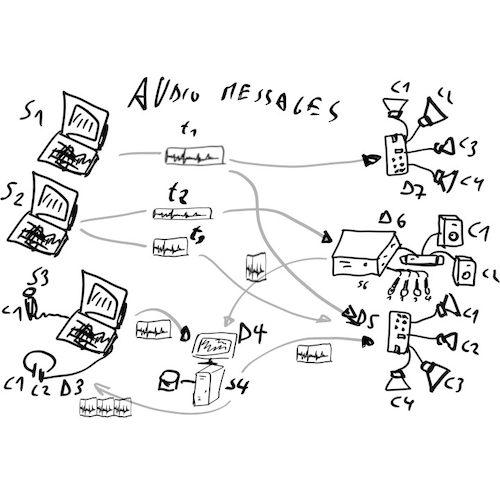

Aoo for Max
===========

This package contains the Max8 externals to work with [Audio over OSC](https://aoo.iem.sh/), a lightweight and flexible peer-to-peer audio streaming and messaging library

	

---
## Installation
Copy the `Aoo for Max` folder into your Max `Packages` folder (in MacOs it is usually under `/Users/<user>/Documents/Max 8/Packages`) or set the path in Max under `Options > File Preferences...` 

---
## History
The vision of AOO was first presented in 2009 by Winfried Ritsch together with a proof-of-concept for embedded devices. In 2010 it has been implemented by Wolfgang Jäger as a library (v1.0-b2) with externals for Pure Data (Pd), but its practical use remained limited.

AOO 1.0 is the topic of Winfried Ritsch's paper "towards message based audio systems" which he presented at LAC 2014.
In 2020 AOO has been reimplemented from scratch by Christof Ressi.

The first draft version has been developed in February 2020 for a network streaming project at Kunsthaus Graz with Bill Fontana, using an independent wireless network infrastructure FunkFeuer Graz.
It was subsequently used for the Virtual Rehearsal Room project which allowed musicians at the University of Arts Graz to rehearse and perform remotely during the early Covid pandemic.
The first public pre-release of AOO 2.0 has been published in April 2020.
Since then it has been used in several art projects and software applications.

---
## Authors

[Davide Gagliardi](https://www.davidegagliardi.eu)
[Francesca Seggioli]()

---
## Contributing

**Aoo for Max** is an open-source project. The source code is hosted on [Github](https://github.com/ddgg-el/aoo-for-max8).
